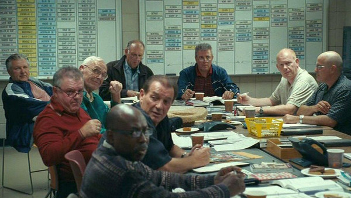

# nfl-prospects-nlp

## Notes (Still WIP)
NLP analysis, summarization, question-answering, etc. etc. of NFL.com's draft prospects report using Hugging Face base models.

Scrape from NFL.com -> Insert and save in database or csv -> NLP analysis -> prediction / generation / final product

https://www.nfl.com/draft/tracker/prospects/  
https://huggingface.co/blog/sentiment-analysis-python  

https://github.com/JasonKessler/Scattertext-PyData  
https://github.com/JasonKessler/scattertext  
https://colab.research.google.com/drive/1xAXQqUJQnHKBu4K8Z_itMqmC7JPQzD0T#scrollTo=IQx-CuS4KLCC

## Introduction
Football analytics in the modern era is highly sophisticated. The NFL uses player tracking to measure speed and movement, teams dedicate entire departments to analytics and analysis, and there are even entire Python and R libraries dedicated to advanced performance metrics. 

However, there's still an aspect to the game that's based on qualitative data, generated by experienced professionals (scouts, player development). Projecting a player's perfomance in college to what they might do at the professional level is often highly qualitative.

 The stocastic nature of football keeps this kind of data valuable. There are things that numbers simply cannot reveal about how a player will perform. It's what keeps people like this employed (*Moneyball*, 2011):  

  

  
  

Can we draw any conculsions from the way scouts write about a prospect? Does the sentiment of their analysis correlate to the player's grade?

## Data
3,969 NFL prospect reports scraped from NFL.com  

2014-2022 NFL drafts  

Reports include a text-based assessment of the player and a grade  

NFL Prospect Grading System:
* 5.50 - 5.59: Priority Undrafted Free Agent
* 5.60 - 5.69: Candidate for Bottom of Roster or Practice Squad
* 5.80 - 5.99: Average Backup or Special Teamer
* 6.00 - 6.09: Traits or Talents to be Above-Average Backup
* 6.10 - 6.19: Good Backup with Potential to Develop into Starter
* 6.20 - 6.29: Will Eventually be Average Starter
* 6.30 - 6.39: Will Eventually be Plus Starter
* 6.40 - 6.49: Will become good starter within two years
* 6.50 - 6.60: Boom or Bust Potential
* 6.70 - 6.90: Year One Starter
* 7.00 - 7.10: Pro Bowl Talent
* 7.30 - 7.50: Perennial All-Pro
* 8.00: The Perfect Prospect

## Analysis
First, let's take a look at how the distribution of player grades looks for these prospects:  

  

  

hhee
## Modeling

#### Sources
@TODO
Cite these properly
https://huggingface.co/blog/sentiment-analysis-python
https://github.com/JasonKessler/Scattertext-PyData
https://github.com/JasonKessler/scattertext
https://github.com/jacobdanovitch/Trouble-With-The-Curve
